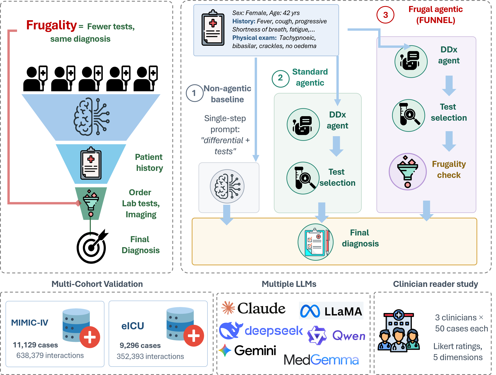

# FUNNEL

FUNNEL (**F**rugal **U**se of **N**ecessary and **N**onredundant **E**valuation by **L**anguage-model agents) is a zero-shot framework for evaluating diagnostic accuracy together with diagnostic resource use. It adds a cost-aware review step to an agentic clinical reasoning pipeline to reduce unnecessary testing while preserving diagnostic performance.

This repository contains the preprocessing and inference code used for the MIMIC-IV development evaluation and multicentre eICU validation. MIMIC-IV was evaluated with non-agentic, standard agentic and FUNNEL configurations. The eICU validation used the standard agentic and FUNNEL configurations.

<p align="center">
  
</p>

<p align="center"><em>Overview of the FUNNEL framework and study design.</em></p>

> [!IMPORTANT]
> FUNNEL is research software and is not a clinical decision-support system. It must not be used to guide patient care.

## Repository structure

```text
.
|-- baseline_code/          # MIMIC-IV non-agentic baseline
|-- agentic_code/           # Complete standard agentic and FUNNEL pipeline
|-- eicu_overrides/         # Files that differ for the eICU evaluation
|-- preprocessing/
|   |-- data_merge.py       # Merge disease-specific MIMIC-IV cohorts
|   |-- eicu_process.py     # Construct the eICU cohort
|   `-- eicu_sampling.py    # Diagnosis-stratified eICU sampling
|-- figures/
|   |-- FUNNEL_overview.png
|   `-- FUNNEL_overview.svg
|-- requirements.txt
`-- README.md
```
`agentic_code/` contains the complete shared implementation. `eicu_overrides/` contains only the eICU-specific versions of `agents.py`, `config.py`, `config_loader.py`, `evaluator.py`, `llm_client.py`, `main_processor.py`, `run_headless.py` and `utils.py`.

## How to use

### 1. Create the environment

The code was developed with Python 3.10.

```bash
git clone https://github.com/<organization>/<repository>.git
cd <repository>
python -m venv .venv
```

Activate the environment and install dependencies:

```bash
# Linux or macOS
source .venv/bin/activate

# Windows PowerShell
.venv\Scripts\Activate.ps1

pip install -r requirements.txt
```

The pipelines support self-hosted models through a vLLM OpenAI-compatible endpoint, Google Vertex AI and Anthropic.

### 2. Obtain the source data

Patient-level data are not distributed with this repository. Access requires PhysioNet credentialing, completion of the required training and acceptance of the applicable data-use agreement.

- [MIMIC-IV version 2.2](https://physionet.org/content/mimiciv/2.2/)
- [eICU Collaborative Research Database version 2.0](https://physionet.org/content/eicu-crd/2.0/)

The MIMIC-IV preprocessing workflow builds on [CliBench](https://github.com/CliBench/CliBench) and the [MIMIC Clinical Decision Making Dataset](https://github.com/paulhager/MIMIC-Clinical-Decision-Making-Dataset). Follow those repositories to generate the disease-specific inputs.

Do not commit raw, processed or model-reconstructed patient-level data to GitHub.

### 3. Prepare the cohorts

Configure the input and output paths in each preprocessing script.

```bash
# Merge disease-specific MIMIC-IV inputs
python preprocessing/data_merge.py

# Construct the final eligible eICU cohort
python preprocessing/eicu_process.py

### 4. Configure the pipelines

Update the relevant `config.py` with:

- Input and output paths
- Model provider and exact model identifier
- vLLM endpoint or provider credentials
- Test-label and cost files
- Inference parameters and token limits
- FUNNEL budget cap

Keep credentials outside version control. Use environment variables such as `ANTHROPIC_API_KEY` and `GOOGLE_APPLICATION_CREDENTIALS`. Do not commit `.env` files, service-account JSON files, private endpoints or internal project identifiers.

### 5. Run MIMIC-IV

Non-agentic baseline:

```bash
cd baseline_code
python main.py
```

Standard agentic pipeline or FUNNEL:

```python
# Standard agentic
USE_LLM_FRUGALITY = False

# FUNNEL
USE_LLM_FRUGALITY = True
```

```bash
cd agentic_code
python run_headless.py --config config.py
```

### 6. Run eICU

Create a temporary copy of the shared agentic pipeline and overlay the eICU-specific files.

```bash
# Linux or macOS
cp -R agentic_code eicu_run
cp eicu_overrides/*.py eicu_run/
cd eicu_run
```

```powershell
# Windows PowerShell
Copy-Item agentic_code eicu_run -Recurse
Copy-Item eicu_overrides\*.py eicu_run\ -Force
Set-Location eicu_run
```

Set `USE_LLM_FRUGALITY = False` for the standard agentic comparator or `USE_LLM_FRUGALITY = True` for FUNNEL, then run:

```bash
python run_headless.py --config config.py
```
No non-agentic baseline was implemented for eICU.

## Outputs

Case-level results and plots are written to the configured output directory. Outputs include predicted and reference diagnoses, diagnostic correctness, proposed and retained tests, resource-use metrics, cost metrics, Frugality Ratio, Cost Efficiency Score, and Frugality Index.

Refer to the manuscript for the final metric definitions and statistical analyses.

## Citation and acknowledgements

If you use FUNNEL, please cite the associated manuscript. The final citation and DOI will be added after publication or public preprint release.

Please also cite the source datasets and preprocessing resources:

1. Johnson AEW, Bulgarelli L, Pollard TJ, et al. MIMIC-IV, version 2.2. PhysioNet. 2023. doi:[10.13026/6mm1-ek67](https://doi.org/10.13026/6mm1-ek67).
2. Pollard TJ, Johnson AEW, Raffa JD, et al. eICU Collaborative Research Database, version 2.0. PhysioNet. 2019. doi:[10.13026/C2WM1R](https://doi.org/10.13026/C2WM1R).
3. Ma MD, Ye C, Yan Y, et al. CliBench: Multifaceted Evaluation of Large Language Models in Clinical Decisions on Diagnoses, Procedures, Lab Test Orders and Prescriptions. 2024. [Repository](https://github.com/CliBench/CliBench).
4. Hager P, Jungmann F, Holland R, et al. Evaluation and mitigation of the limitations of large language models in clinical decision-making. *Nature Medicine*. 2024. doi:[10.1038/s41591-024-03097-1](https://doi.org/10.1038/s41591-024-03097-1).
